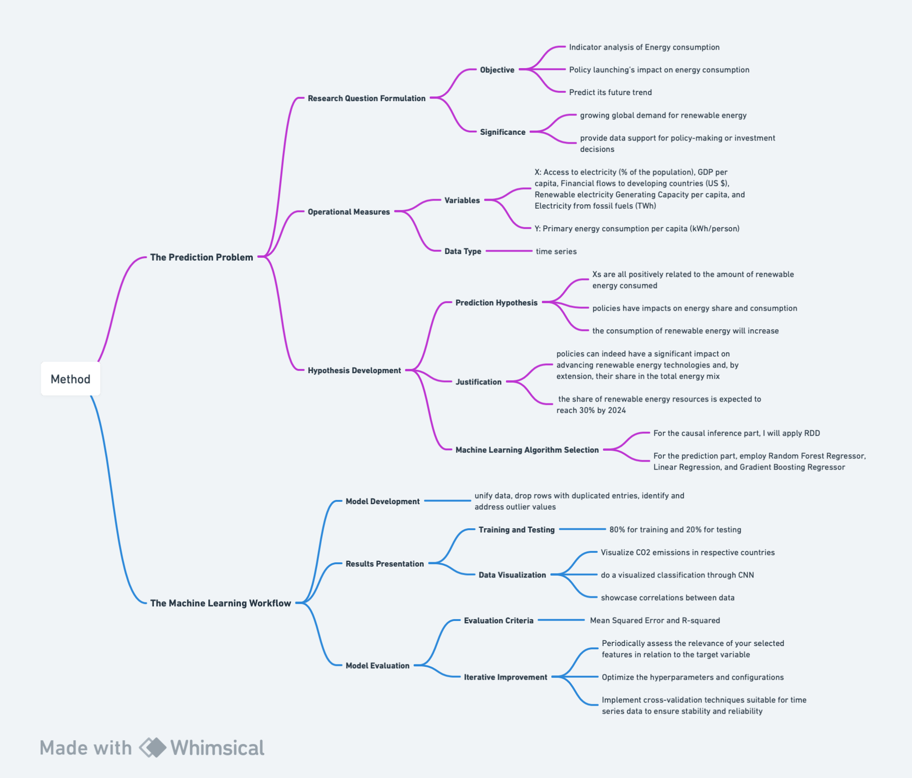

In Method, I will introduce my research on Machine Learning for Prediction and Causal Inference from the research prolem and the machine learning workflow:

## 1.1. The Prediction Problem

### Research Question Formulation: 
1. Objective: 
- Indicator analysis of Energy consumption
- Policy launching’s impact on energy consumption 
- Predict its future trend
2. Significance: 

    With the growing global demand for renewable energy, understanding the main factors affecting energy consumption becomes crucial. The proliferation of renewable energy is essential for achieving climate targets, reducing dependence on fossil fuels, and promoting sustainable economic development. In this research, I may also study the causal inference to check whether associated policy launching would change energy consuming trend. Therefore, it is significant to analyze the key factors affecting energy consumption and predict future consumption trends to provide data support for policy-making or investment decisions.
### Operational Measures: 
1. Variables:
   
I begin by selecting a target variable representing energy consumption trends, this being Primary energy consumption per capita (kWh/person), which is Y. Then, relevant features, encompassing attributes that could impact energy consumption, are X variables. They might be Access to electricity (% of the population), GDP per capita, Financial flows to developing countries (US $), Renewable electricity Generating Capacity per capita, and Electricity from fossil fuels (TWh) due to their direct or indirect impact on energy utilization patterns.
Data Type: The dataset is a time series with an annual frequency.
### Hypothesis Development:
1. Prediction Hypothesis:
   
The X variables, access to electricity, GDP per capita, financial flows to developing countries (US $), renewable electricity Generating Capacity per capita, and electricity from fossil fuels (TWh) are all positively related to the amount of renewable energy consumed. For example, Higher GDP per capita might correlate with increased energy consumption due to higher industrial and domestic energy demands. Also, policy can make great changes to energy share and consumption. What’s more, the consumption of renewable energy will increase in the future. 

2. Justification:
   
First of all, by common sense, we know that if citizens have easier or more access to renewable energy, consumption will increase accordingly.
Additionally, a study suggests that CCPs increase green patents from 2000 to 2021 (Bettarelli et al., 2023). This indicates that policies can indeed have a significant impact on advancing renewable energy technologies and, by extension, their share in the total energy mix.
Lastly, according to the IEA, the share of renewable energy resources is expected to reach 30% by 2024, which is a larger proportion compared to that of today (Emily, 2023). It is a strong proof of my hypothesis.

3. Machine Learning Algorithm Selection:

For the causal inference part, I will apply RDD. RDd is particularly suitable for evaluating the causal impact of policy launching where there is a clear cut-off for receiving the treatment. Also, RDD can be particularly insightful as the policy’s implementation varied significantly across different regions or at different times.

For the prediction part, I would like to employ three different regression models for prediction: Random Forest Regressor, Linear Regression, and Gradient Boosting Regressor. Random Forest Regressor is chosen for its ability to handle non-linear relationships, Linear Regression for simplicity and interpretability, and Gradient Boosting Regressor for its high accuracy in complex datasets. Each model has its unique strengths, which I will explore and compare, and finally find the best one to fit. 

## 1.2. The Machine Learning Workflow 
### Model Development: 
This dataset is a very comprehensive and completed dataset. For data processing, firstly, I plan to unify data, including column names and measurement units. Secondly, I will search for and drop rows with duplicated entries. Additionally, I will identify and address outlier values to improve data quality
### Results Presentation:
1. Training and Testing:
   
The results will be shown by their Mean Squared Error and R-squared, in order to find the best fitted model.
The dataset is split into 80% for training and 20% for testing, which is a common splitting percentage. Model performance will be regularly evaluated during training to avoid overfitting, ensuring that the models generalize well to unseen data.

2. Data Visualization:

First, to Visualize CO2 emissions in respective countries, I will plot line charts, bar charts, etc. Line charts will illustrate trends over time, while bar charts will compare renewable energy consumption across different regions.
Second, I may plan to do a visualized classification through CNN, to classify different levels of renewable energy consumption. It will make prediction work better in principle, since the data in the same group may have similar features.
Finally, to showcase correlations between data embedded in the dataset, I will use the correlation heatmap, which is the most intuitive diagram.
 
### Model Evaluation:
1. Evaluation Criteria:
   
The results will be shown by their Mean Squared Error and R-squared, in order to find the best fitted prediction model.

2. Iterative Improvement:
   
- Ongoing Feature Evaluation:
Periodically assess the relevance of my selected features in relation to the target variable "Primary energy consumption per capita (kWh/person)." Remove or replace features that do not contribute significantly to the model's predictive accuracy.
- Algorithm Fine-tuning: 
Optimize the hyperparameters and configurations specific to the Random Forest Regressor, Linear Regression, and Gradient Boosting Regressor.
- Stability Assessment: 
Implement cross-validation techniques suitable for time series data to ensure stability and reliability. 

## References
[1] Bettarelli, Luca, Davide Furceri, Pietro Pizzuto, and Nadia Shakoor. 2023. "Environmental Policies and Innovation in Renewable Energy." International Monetary Fund. September 1. https://www.imf.org/en/Publications/WP/Issues/2023/09/01/Environmental-Policies-and-Innovation-in-Renewable-Energy-538759.

[2] Folk, Emily. “What the Future of Renewable Energy Looks Like.” Earth.Org, April 3, 2023. https://earth.org/the-growth-of-renewable-energy-what-does-the-future-hold/. 

## Method Flowchart

